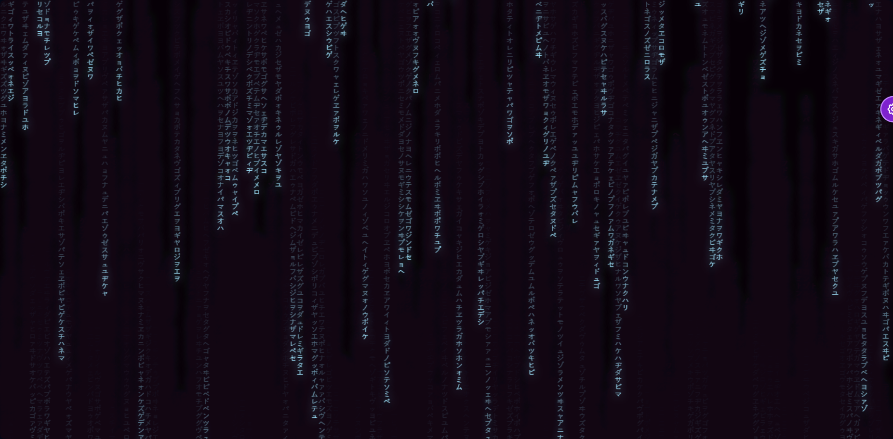

# Matrix Effect App

A browser-based app that generates a **Matrix-inspired digital rain effect**.  
You can customize animation parameters and enjoy the iconic flow of symbols.  

🔗 **Live Demo:** [Click here to try it out](https://wowkdigital.github.io/martix/)  

## Features
- Matrix-style falling streams of characters  
- Adjustable parameters (speed, number of columns, font size, etc.)  
- Mobile-friendly responsive design 📱  
- Modern UI with **Lucide Icons**  

## Tech Stack
- HTML + CSS (Tailwind)  
- JavaScript (Canvas API)  
- Lucide Icons  

## Screenshot

---

💡 This project was created as an experiment with Canvas animations and modern UI/UX design.  
